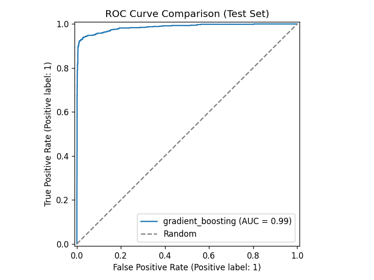
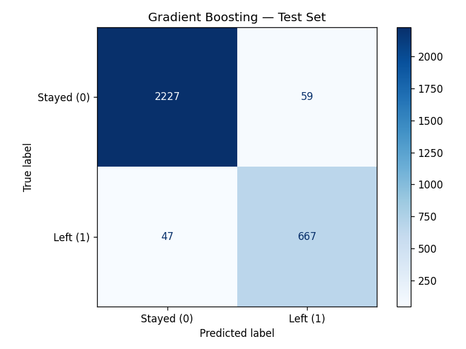

# Employee Churn ML Pipeline

End-to-end machine learning pipeline to predict employee attrition and assign **turnover risk zones** for HR action. Built as a portfolio project demonstrating reproducible training, imbalance handling, model comparison, and scored outputs—not a production HR system.

## Business problem

Employee turnover is expensive. HR teams need early signals on who might leave so managers can intervene. This repo provides a repeatable workflow: load data → encode features → stratified split → SMOTE on training data only → compare models on a holdout set → export risk scores.

## Dataset

| Item | Detail |
|------|--------|
| **Name** | IBM HR Analytics Employee Attrition (`HR_comma_sep.csv`) |
| **Rows** | 14,999 |
| **Target** | `left` — 1 = left company, 0 = stayed |
| **Churn rate** | ~23.8% (`left = 1`) — imbalanced; SMOTE applied on train only |
| **Download** | [data/README.md](data/README.md) — raw CSV is not committed to git |

**Features used in modeling:** `satisfaction_level`, `last_evaluation`, `number_project`, `average_montly_hours` (column name as in source file), `time_spend_company`, `Work_accident`, `promotion_last_5years`, plus one-hot encoded `sales` and `salary`. The target column `left` is excluded from features (see [src/features.py](src/features.py)).

## Methodology

```
CSV → clean columns → one-hot encode → stratified 80/20 split
    → SMOTE (train only) → 5-fold CV on train → test ROC-AUC
    → save Gradient Boosting → risk zones on holdout employees
```

| Step | Implementation |
|------|----------------|
| Split | `train_test_split(..., stratify=y, test_size=0.2, random_state=123)` **before** any resampling |
| Imbalance | `SMOTE` applied to the **training** split only ([src/train.py](src/train.py)) |
| Primary metric | **ROC-AUC** on stratified holdout (ranking quality under class imbalance) |
| Validation | 5-fold stratified cross-validation on SMOTE-resampled training data |
| Scoring artifact | Gradient Boosting → `models/churn_model.pkl` + `models/feature_columns.json` |
| HR output | `turnover_probability` + Green / Yellow / Orange / Red **risk zones** ([src/predict.py](src/predict.py)) |

There is **no** global scaling step; preprocessing does not fit on the combined train+test set beyond building the full category vocabulary for one-hot columns before the split.

## Scoring model vs evaluation benchmark

Two models play different roles in this repo:

| Role | Model | Rationale |
|------|--------|-----------|
| **Holdout benchmark (generalization)** | Logistic Regression (ROC-AUC **0.8155**) | More stable ranking metric on this dataset; less sensitive to duplicate rows and rule-like bins than trees |
| **Saved scorer (risk segmentation)** | Gradient Boosting (ROC-AUC **0.9857**) | Used by [scripts/score.py](scripts/score.py) to produce calibrated-enough probability spreads for the four HR risk zones; aligns with the original notebook workflow |

**Logistic regression** is the reference for how well the model **ranks** churn on unseen employees. **Gradient boosting** is the operational artifact for **probability-based risk bands**—not because it is assumed to generalize better. Under stricter evaluation (deduplicated or group-split holdouts), tree ROC-AUC remains high on this CSV; see [Evaluation Notes](#evaluation-notes).

## What is committed to GitHub

| Path | In git? | Notes |
|------|---------|--------|
| [outputs/metrics.json](outputs/metrics.json) | Yes | Executed test metrics (`_meta.status: executed`) |
| [outputs/figures/roc_comparison.png](outputs/figures/roc_comparison.png) | Yes | Generated by training |
| [outputs/figures/confusion_matrix_gradient_boosting.png](outputs/figures/confusion_matrix_gradient_boosting.png) | Yes | Generated by training |
| `data/raw/HR_comma_sep.csv` | No | Download locally ([data/README.md](data/README.md)) |
| `models/churn_model.pkl` | **No** | Intentionally gitignored; run training locally |
| `models/feature_columns.json` | No* | Written by `scripts/train.py` alongside the pickle |

\*Not listed in `.gitignore`, but treated as a **local training artifact**—regenerate with the model. Clone → download CSV → `python scripts/train.py` before `python scripts/score.py`.

## Results (holdout test set)

Primary comparison metric: **ROC-AUC** (stratified 20% holdout, 3,000 rows). Source: [outputs/metrics.json](outputs/metrics.json).

| Model | Test ROC-AUC | Interpretation |
|-------|--------------|----------------|
| **Logistic Regression** | **0.8155** | **Conservative benchmark** for ranking / generalization |
| Random Forest (200 trees) | 0.9954 | Inflated on this dataset; see Evaluation Notes |
| Gradient Boosting | 0.9857 | Saved scorer for risk zones |

**How to read these numbers:** Under ~24% positive class and heavy duplication, accuracy is misleading. ROC-AUC summarizes ranking quality across thresholds. Tree models score much higher here because of duplicate rows and near-deterministic feature bins—not because they are safe to deploy unchanged.

### Imbalance and churn class (Gradient Boosting, holdout)

From the same run ([outputs/metrics.json](outputs/metrics.json)):

| Metric | Class 0 (stayed) | Class 1 (left) |
|--------|------------------|----------------|
| Support | 2,286 | 714 |
| Precision | 0.98 | 0.92 |
| Recall | 0.97 | 0.93 |
| F1 | 0.98 | 0.93 |

Holdout **ROC-AUC: 0.9857** (Gradient Boosting). Minority-class recall (~0.93) matters more than overall accuracy for HR intervention use cases.

### Risk segmentation (holdout)

Gradient Boosting probabilities mapped to zones ([src/predict.py](src/predict.py)):

| Zone | Count (holdout) |
|------|-----------------|
| Safe (Green) | 2,091 |
| Low Risk (Yellow) | 209 |
| Medium Risk (Orange) | 81 |
| High Risk (Red) | 619 |

Thresholds are portfolio defaults (0.2 / 0.6 / 0.9); production would require calibration against business cost.

### Figures

Generated by `python scripts/train.py` (committed in repo):

| Figure | Description |
|--------|-------------|
| ROC comparison | All three models on holdout |



| Figure | Description |
|--------|-------------|
| Confusion matrix | Gradient Boosting on holdout |



**Regenerate** metrics, model, and plots after placing the CSV:

```bash
python scripts/train.py
```

## Evaluation Notes

A **leakage audit** was performed on the pipeline code and the dataset (manual review of [src/train.py](src/train.py), [src/features.py](src/features.py), and holdout checks).

### Leakage audit (pipeline)

| Check | Finding |
|-------|---------|
| Train/test order | **Pass** — stratified split occurs **before** SMOTE; test data is never resampled |
| Target leakage | **Pass** — `left` is dropped from features; no label column in `X` |
| Churn-encoded features | **Pass** — no feature named `churn` / `attrition`; inputs are standard HR fields |
| Preprocessing scope | **Pass** — no `StandardScaler` or imputer fit on full data; SMOTE fits on train only |
| Duplicate labels | **Pass** — no conflicting `left` values for identical feature rows |

**Conclusion:** No classic target leakage or incorrect split order was found in the training code.

### Dataset characteristics (why tree AUC is so high)

These are **data** effects, not pipeline bugs:

1. **Duplicate rows (~20%)** — 3,008 of 14,999 rows are exact duplicates (same features and same `left`). After an 80/20 split, **~31% of holdout rows** share an identical feature vector with at least one training row (always with the **same** label). That helps tree models memorize and can inflate holdout scores.

2. **Highly separable patterns** — Univariate churn rates are extreme for some bins (e.g. `number_project` = 7 → 100% left; very high `average_montly_hours` → 100% left). Even with stricter checks, tree models still score high:
   - Deduplicate entire dataset, then split: Random Forest test ROC-AUC ≈ **0.98**
   - **Group split** (all duplicate feature groups in one fold only): Random Forest ≈ **0.99**, Logistic Regression ≈ **0.82**

3. **Conservative benchmark** — **Logistic Regression (0.8155 ROC-AUC)** is the recommended summary for expected ranking performance on new employees.

For future work, reporting **group-split** or **deduplicated** metrics alongside the standard holdout would give a more conservative tree-model estimate.

## Technologies

Python · pandas · scikit-learn · imbalanced-learn · joblib · matplotlib

## Project structure

```
employee-churn-ml-pipeline/
├── src/
│   ├── config.py
│   ├── features.py       # Load + encode (target excluded)
│   ├── train.py          # Split → SMOTE → CV → test metrics → save model
│   ├── evaluate.py       # ROC + confusion matrix plots
│   └── predict.py        # Risk zones + scoring
├── scripts/
│   ├── train.py          # Entry point for training
│   └── score.py          # Score CSV → risk export (requires local model)
├── notebooks/
│   └── employee_churn_pipeline.ipynb   # EDA (exploratory)
├── data/README.md
├── models/               # churn_model.pkl + feature_columns.json (local only)
└── outputs/
    ├── metrics.json
    └── figures/
        ├── roc_comparison.png
        └── confusion_matrix_gradient_boosting.png
```

## Quick start

```bash
cd employee-churn-ml-pipeline
python -m venv .venv
source .venv/bin/activate   # Windows: .venv\Scripts\activate
pip install -r requirements.txt

# 1) Place HR_comma_sep.csv in data/raw/  (see data/README.md)
cp ~/Downloads/HR_comma_sep.csv data/raw/

# 2) Train — writes metrics, figures, and models/ artifacts
python scripts/train.py

# 3) Score employees (requires step 2)
python scripts/score.py --top 15
```

## Risk zones

Scoring uses the locally trained Gradient Boosting model. Zones are defined in [src/predict.py](src/predict.py):

| Probability | Zone |
|-------------|------|
| under 0.2 | Safe (Green) |
| 0.2 – 0.6 | Low Risk (Yellow) |
| 0.6 – 0.9 | Medium Risk (Orange) |
| 0.9 and above | High Risk (Red) |

## Notebook

[notebooks/employee_churn_pipeline.ipynb](notebooks/employee_churn_pipeline.ipynb) contains exploratory analysis (EDA, KMeans on employees who left). **Canonical training and evaluation** live in [src/train.py](src/train.py) and [scripts/train.py](scripts/train.py).

## Future improvements

- Report group-split / deduplicated metrics in `metrics.json`
- XGBoost with SHAP for interpretability
- FastAPI batch scoring endpoint
- MLflow experiment tracking

## Author

Natia Gogitidze — AI/ML Data Engineer portfolio project
